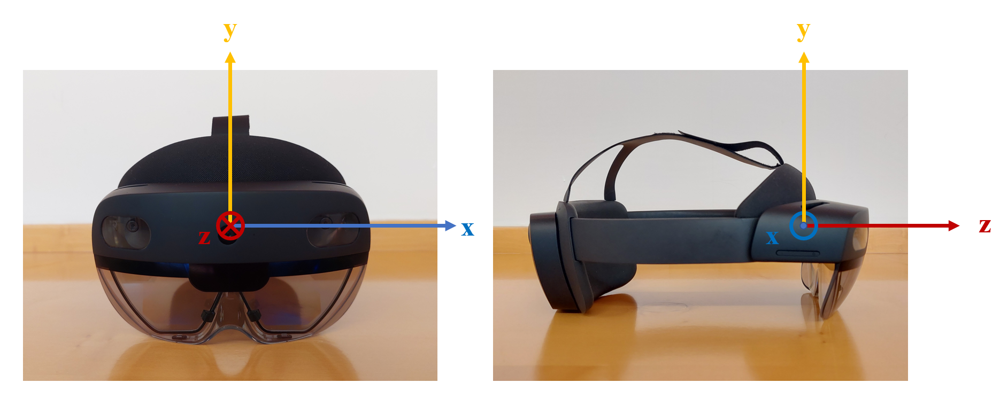

# Stress Assessment for Augmented Reality Applications based on Head Movement Features


In the repository, you can find the codes related to the paper: 


A. Ferrarotti, S. Baldoni, M. Carli and F. Battisti, "Stress Assessment for Augmented Reality Applications Based on Head Movement Features," in IEEE Transactions on Visualization and Computer Graphics, doi: 10.1109/TVCG.2024.3385637.

## Repository structure
The repository contains the following items:

- **Scripts**:
    - stats_ANOVA is a MATLAB script containing all the ANOVA tests performed. In addition, it allows to generate Figure 6(a) of the paper.
    - stats_WelchANOVA is a Python script containing the Welch's ANOVA tests performed of the STFT coefficients of the analyzed features.
    - nasa_results is a MATLAB script that allows to replicate the t-test performed to evaluate whether the NASA-TLX results of the Stroop Color Word Test and the Mental        Arithmetic test are statistically different. It allows also to generate Figure 8 of the paper.
    - phaseStress_classifier is a MATLAB script used to train and validate the classifiers of the proposed architecture.
    - testStressClassifier is a MATLAB script that allows to test the proposed architecture.
    - getFeatures_fixed is a MATLAB function used to extract the recorded head movement data from the .txt files related to the users performing the Stroop Color Word         test.
    - getFeatures_MA is a MATLAB function used to extract the recorded head movement data from the .txt files related to the users performing the Mental Arithmetic         test.
    - hypothesis_check is a MATLAB function used to verify the hypothesis required by the ANOVA tests for the selected head movement features.

      
- **Data**
  - **trained_models_unw** contains the Support Vector Machines models trained on the Stroop Color Word Test and that are used in the testStressClassifier code.

    
- **Folders:**
  - **file_paths** contains all the file paths pertinent to the recorded head movement data.
  - **Head Movements Dataset.zip** contains the complete dataset acquired for the study. Further details on its structure are given in the next section. **Plese make         sure to unzip the folder and place it in the same folder as the other codes to run them.**
  - **Stats-Stroop STFT** contains the STFT coefficients of the analyzed features that are used for statistical analysis in the code stats_WelchANOVA.py.
 
## Dataset
The Head Movement Dataset is composed of the data of 100 users who participated in a laboratory subjective experiment aimed at analyzing the head movements of users wearing an Head Mounted Display (HMD) for Augmented Reality (AR) (Microsoft Hololens 2). During the experiment, users head movements were recorded with the objective of relating them to the       onset of a stress situation.

Data have been recorded during three different acquisition sessions:
- Session #1 and Session #2: participants performed a Stroop Color Word Test (SCWT).
- Session #3: participants performed both the SCWT and a Mental Arithmetic (MA) test.


The Head Movement Dataset folder is organized as follows:
- The data acquired during the three sessions are divided in the three folders Session1, Session2, and Session3.
- In the Session1 folder there are:
     - 60 folders containing the head movement data acquired during the SCWT for each user, identified by "ID" and a number.
     - A .csv file named "SSQ_Session1.csv" containing all the asnwers users provided to the Simulator Sickness Questionnaire (SSQ).
- In the Session2 folder there are:
     - 20 folders containing the head movement data acquired during the SCWT for each user, identified by "VAL" and a number.
     - A .csv file named "SSQ_Session2.csv" containing all the asnwers users provided to the Simulator Sickness Questionnaire (SSQ).
- In the Session1 folder there are:
     - 20 folders containing the head movement data acquired during the SCWT and the MA for each user, identified by "T" and a number.
     - A .csv file named "SSQ_Session3.csv" containing all the asnwers users provided to the Simulator Sickness Questionnaire (SSQ).
     - A .csv file named "NASA-TLX_Session3_SCWT.csv" containing all the answers users provided to the NASA-TLX questionnaire for the SCWT.
     - A .csv file named "NASA-TLX_Session3_MA.csv" containing all the answers users provided to the NASA-TLX questionnaire for the MA test.


In each user folder, there is at leas one .txt file containing the recorded head movement data organized as follows:
- For Session1 and Session2 folders, the .txt file is called "Record_" followed by a timestamp related to the time aat which the file was created. Inside the Session3 folder, the recordings are divided into two different files related to the two stress-inducing tasks. Data acquired during the SCWT are collected in files named "Record_" followed by a timestamp related to the time at which the folder was creaed and "-S". Data acquired during the MA test are collected in files named "Record_" followed by a timestamp related to the time at which the folder was creaed and "-M".
- For each row, the first number is a timestamp in the format hh:mm:ss.ssss. For instance, the timestamp "1200030277" is equivalent to a time "12:00:03.0277".
- Next to the timestamps, there is a triplet of numbers in the format (x,y,z) representing the position of the head at the corresponding timestamp.

The SCWT consisted of three phases:
- Non-stress phase 1: from the start of the test to 23 seconds.
- Non-stress phase 2: from 23 to 43 seconds.
- Stress phase: from 43 to the end of the test.


The MA test consisted of two phases:
- Non-stress phase: from the start to 1 minute.
- Stress phase: from 1 minute to the end of the test.

The SSQ files are organized as follows:
- The first number refers to the user identification number.
- The following numbers represent the level of perception of the different symptoms:
  - An answer "None" corresponds to a 0 inside the .csv file.
  - An answer "Slight" corresponds to a 1 inside the .csv file.
  - An answer "Moderate" corresponds to a 2 inside the .csv file.
  - An answer "Severe" corresponds to a 3 inside the .csv file.


The NASA-TLX files are organized as follows:
- The first number refers to the user identification number.
- For each one of the six dimensions of task load the first number represents the corresponding weight and the second number the assigned score.
- The last two numbers represent the total raw score and the total weighted score.

## Versions and Toolboxes used
The versions used for the scripts are MATLAB R2023b and Python 3.9.0. The toolboxes used for MATLAB are the following:
  - Signal Processing Toolbox.
  - Statistics and Machine Learning Toolbox.
## How to cite
If you want to use any part of this work, please use the following reference:

```
@ARTICLE{10493844,
author={Ferrarotti, Anna and Baldoni, Sara and Carli, Marco and Battisti, Federica},
journal={IEEE Transactions on Visualization and Computer Graphics}, 
title={Stress Assessment for Augmented Reality Applications Based on Head Movement Features}, 
year={2024},
volume={},
number={},
pages={1-14},
keywords={Human factors;Stress;Task analysis;Anxiety disorders;Magnetic heads;Resists;Stress measurement;Augmented reality;machine learning classifier;stress detection},
doi={10.1109/TVCG.2024.3385637}}
```
